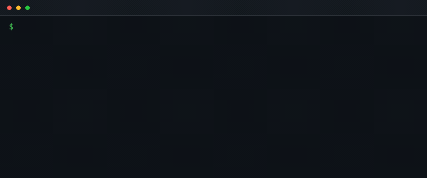

# ARKEXA

**Finds the prompt injections in your CI that an outsider can actually reach.**

[](https://github.com/alokgorithm/ARKEXA/actions/workflows/ci.yml)
[](LICENSE)

You wired an AI agent into GitHub Actions. It reads issue bodies. It holds a
write token. ARKEXA finds the paths between those two facts, and reports only
the ones a stranger with a GitHub account can actually trigger.



<details>
<summary>The same output as text</summary>

```
CRITICAL ARK001  untrusted-prompt-write-token                            reachable: external
  an outsider opens an issue                                                    triage.yml:2
    -> github.event.issue.body -> env.BODY                                     triage.yml:13
    -> env.BODY -> the claude command line of Ask the model to triage          triage.yml:18
    -> job 'triage' holds contents: write, issues: write                       triage.yml:10
  = text an outsider controls is instruction-adjacent to an agent that can write to your
    repository
  fix: pass untrusted text as a file the agent reads as data, drop the job to read-only
       permissions, or gate the job on author_association
```

The GIF is generated by `python tools/make_demo.py`, which runs ARKEXA against
`tools/demo` for real. It is not a screenshot anyone touched up, so it cannot
drift from what the tool actually prints.

</details>

## Install

The first published version is a pre-release, and pip does not install
pre-releases unless you ask, so name it explicitly:

```bash
pipx install "arkexa==0.1.0a1"      # or: uv tool install "arkexa==0.1.0a1"
```

A plain `pipx install arkexa` will start working when 0.1.0 is released, and
will keep ignoring alphas after that, which is the behaviour you want.

To run it from source instead:

```bash
pipx install git+https://github.com/alokgorithm/ARKEXA
```

## Use

```bash
arkexa                          # scan ./.github/workflows
arkexa /path/to/repo
arkexa --reachability all       # include findings only a maintainer can trigger
arkexa --format json
arkexa --only ARK001,ARK002
arkexa --severity critical      # only fail the build on critical findings
arkexa --explain ARK001
arkexa --list-rules
```

Exit code is `1` when anything is reported at or above the severity threshold,
so it works as a CI gate. `2` means ARKEXA itself had a problem.

## Why not just zizmor?

Run both. They do different jobs.

| | reads | knows what an agent is |
|---|---|---|
| [zizmor](https://github.com/zizmorcore/zizmor) | workflow YAML | no |
| [agent-audit](https://pypi.org/project/agent-audit/) | Python agent code, MCP configs | yes |
| **ARKEXA** | workflow YAML | yes |

zizmor reads your workflows but doesn't know what an agent is. agent-audit
knows agents but doesn't read your workflows. ARKEXA reads workflows *as*
agent attack surface.

**ARKEXA deliberately does not check** template injection into shell,
`pull_request_target` misuse, unpinned actions, credential persistence, or
excessive permissions in general. zizmor does all of those well, and in Rust.
Duplicating them would only add noise.

## Reachability is the point

Most scanners report every dangerous-looking pattern. On agentic workflows that
produces hundreds of findings and everyone stops reading.

ARKEXA classifies every finding by who can trigger it:

| Level | Meaning |
|---|---|
| `external` | any GitHub account - an issue, a comment, a fork PR |
| `contributor` | needs a previously merged pull request |
| `maintainer` | needs write access to the repository |
| `unreachable` | `workflow_dispatch` or `schedule` only |

Only `external` shows by default. An `if:` guard checking `author_association`
demotes a finding automatically, so fixing the guard makes the finding go away
- which is how a scanner should behave. The demotion is shown, not hidden:

```
  note: author_association allowlist limits this to maintainer (triage.yml:9)
```

Narrowing an event helps too. `issues: [labeled]` is not externally reachable,
because labelling an issue takes triage access, so ARKEXA does not report it as
if a stranger could fire it.

## What it finds

| ID | Rule | Severity | OWASP Agentic |
|----|------|----------|---------------|
| [ARK001](docs/rules/ARK001.md) | `untrusted-prompt-write-token` | critical | ASI01 |
| [ARK002](docs/rules/ARK002.md) | `agent-output-to-shell` | critical | ASI05 |
| [ARK003](docs/rules/ARK003.md) | `agent-output-to-path` | high | ASI05 |
| [ARK004](docs/rules/ARK004.md) | `agent-autoapprove` | high | ASI02 |
| [ARK005](docs/rules/ARK005.md) | `agent-writes-default-branch` | high | ASI06 |

## The engine, not the rules

The rules are the easy part. These four are what make the findings accurate.

**Two-hop taint.** Untrusted input is almost never spelled straight into the
sink. It is laundered through `env:`, through `$GITHUB_ENV`, through step
outputs and across `needs.<job>.outputs`. ARKEXA follows it, and prints the
route it took.

**Model provenance.** When an agent reads an issue body and its answer is later
interpolated into a `run:` block, the chain reads all the way from the issue
body through the model to the shell - not from the model, as though the model
had invented the string on its own.

**Guard detection.** `author_association` checks, actor allowlists, label
gates, non-fork checks, narrowed `permissions:`. A scanner that notices you
already fixed something gets kept. One that yells anyway gets uninstalled.

**Local composite actions.** `uses: ./.github/actions/foo` is followed one
level down, carrying the values the caller passed in `with:`, so the chain
crosses the file boundary and each hop names the file it happened in:

```
    -> .github/workflows/main.yml calls ./.github/actions/summarise         main.yml:14
    -> github.event.issue.body -> inputs.body                               main.yml:16
    -> inputs.body -> env.TEXT                           actions/summarise/action.yml:10
```

## No network, no API key

ARKEXA is deterministic static analysis. It makes no network calls, needs no
credentials, and has one runtime dependency (PyYAML). There is no LLM inside
the tool.

## In CI

Three lines, and findings land in the Security tab as annotations:

```yaml
permissions:
  contents: read
  security-events: write   # so the SARIF can be uploaded

jobs:
  arkexa:
    runs-on: ubuntu-latest
    steps:
      - uses: actions/checkout@v4
      - uses: alokgorithm/ARKEXA@v0
```

Pin it to a commit SHA rather than a tag if you would rather a tag move not
change what runs — which is advice this tool gives about other actions, so it
had better take it:

```yaml
      - uses: alokgorithm/ARKEXA@<sha>  # v0.1.0a1
```

The pinned ref decides the scanner version as well as the wrapper, so a pinned
action is reproducible. Useful inputs:

| input | default | what it does |
|---|---|---|
| `path` | `.` | file or directory to scan |
| `reachability` | `external` | `external`, `contributor`, `maintainer`, `all` |
| `severity` | `critical` | fail at this severity or above |
| `upload` | `true` | upload SARIF to code scanning |
| `fail-on-findings` | `true` | set `false` to report without failing the build |

`upload: true` needs `security-events: write`, and code scanning is
unavailable on private repositories without Advanced Security — set it to
`false` there and the SARIF is still written for you to keep as an artifact.

The SARIF is also available on its own, for uploading yourself or feeding to
something else:

```bash
arkexa . --format sarif > arkexa.sarif
```

Or without the action at all:

```yaml
      - run: pipx install "arkexa==0.1.0a1"
      - run: arkexa .
```

## Configuration

`.arkexa.yml`, in the root of the repository. There is a fully commented
[`.arkexa.yml.example`](.arkexa.yml.example) to copy:

```yaml
ignore:
  - rule: ARK004
    path: .github/workflows/nightly.yml
    reason: runs in an isolated container with no token
```

A `reason` is required. An ignore without one is reported and not applied,
because an ignore nobody can explain is how a scanner quietly stops working.

## Adding support for a new agent

Most contributions are one line in
[`src/arkexa/data/agents.yml`](src/arkexa/data/agents.yml). If your team's
agent CLI isn't recognised, add its signature and open a pull request - no
Python required.

## Measured

Nobody publishes precision numbers for CI scanners. Here are ours, including
the part that does not flatter us.

**[Prevalence](benchmark/prevalence/results.md)** — of 49 judgeable workflows
hand-labelled from a random draw of a 98-workflow unbiased sweep, **18 contain
an externally reachable path** from attacker-controlled text to a privileged
agent action: 36.7%, Wilson 95% CI 24.7–50.7%. Labelled by hand before any
scanner was run.

**[Evaluation](benchmark/evaluation/results.md)** — scored against the
externally reachable vulnerable entries:

| tool | precision | recall | total findings |
|---|---|---|---|
| ARKEXA 0.1.0a1 | 67% | **11%** | 4 |
| zizmor 1.30.0 | 45% | 83% | 162 |
| poutine | *unavailable — see results* | | |

**Read that recall number.** ARKEXA finds 2 of the 18 externally reachable
issues. zizmor finds 15. The precision case is real — ARKEXA is right more
often and emits four findings where zizmor emits a hundred and sixty-two,
which is the entire argument for reachability filtering — but it is currently
made by a tool that misses most of what a human labeller called reachable.
Recall is the priority for v0.2.

No rule was changed after seeing these numbers. The labels are ground truth,
and tuning against them would leave nothing worth publishing. The method, the
labelling standards, and the disclosure rules that bind all of it are in
[METHODOLOGY.md](METHODOLOGY.md); the corpus is two corpora, and
[`benchmark/`](benchmark/) explains why.

## Contributing

See [CONTRIBUTING.md](CONTRIBUTING.md). False positives are treated as bugs of
the same severity as false negatives; there are issue templates for both, and
every rule ships with a safe fixture proving it stays quiet. Participation is
governed by the [Code of Conduct](CODE_OF_CONDUCT.md).

Changes are recorded in [CHANGELOG.md](CHANGELOG.md), including any change that
makes a rule report *less* - a scanner that goes quiet without saying so is
worse than one that never ran.

## Security

See [SECURITY.md](SECURITY.md) for how to report a vulnerability in ARKEXA, and
for the disclosure policy that governs findings in other people's repositories.

## License

MIT
